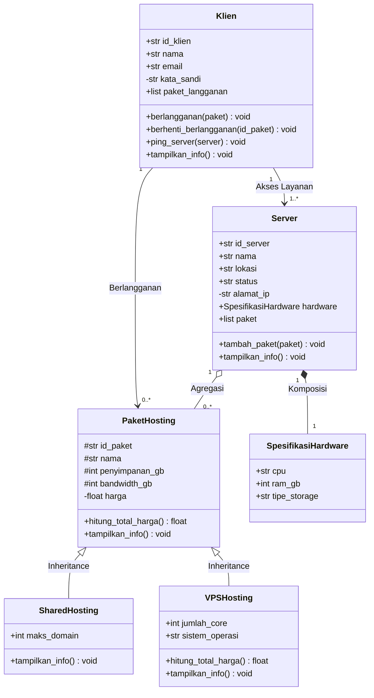

# Sistem Manajemen Hosting Server

Program Python berbasis OOP untuk mensimulasikan pengelolaan layanan hosting. Program mengelola paket hosting, server, klien, langganan, harga, alamat IP, validasi data, serta menerapkan konsep Relasi UML dan Inheritance.

Konsep OOP yang diterapkan:

- Class dan object
- Atribut kelas dan atribut instance
- Encapsulation (Public, Protected `_nama`, Private `__nama`)
- Property, getter, dan setter
- Inheritance (Superclass & Subclass, `super()`, Method Overriding)
- Relasi UML (Asosiasi, Agregasi, Komposisi)
- Validasi input menggunakan `ValueError`

---

## 1. Struktur Folder

```text
post-test-pbo-2/
├── main.py
├── README.md
└── sistem_manajemen_hosting_server/
    ├── __init__.py
    └── models/
        ├── __init__.py
        ├── hardware.py          # Komposisi (SpesifikasiHardware)
        ├── paket_hosting.py     # Superclass (PaketHosting)
        ├── shared_hosting.py    # Subclass 1 (SharedHosting)
        ├── vps_hosting.py       # Subclass 2 (VPSHosting)
        ├── server.py            # Agregasi & Komposisi
        └── klien.py             # Asosiasi
```

---

## 2. Penerapan Relasi UML

### 2.1 Diagram Class UML



```text
+---------------------------------------------------------------------------------+
|                                     KLIEN                                       |
|  - id_klien, nama, email, kata_sandi                                            |
|  + berlangganan(), berhenti_berlangganan(), ping_server()                       |
+---------------------------------------------------------------------------------+
       | (Asosiasi: Berlangganan)                  | (Asosiasi: Akses Layanan)
       |                                           |
       v                                           v
+-----------------------------+             +-------------------------------------+
|        PAKET HOSTING        |  (Agregasi) |               SERVER                |
|  # id_paket, nama, spek     | <◇--------- |  - id_server, nama, lokasi, IP      |
|  - harga                    |   0..*   1  |  + tambah_paket(), tampilkan_info() |
|  + hitung_total_harga()     |             +-------------------------------------+
+-----------------------------+                                |
       ^               ^                                       | (Komposisi)
       | (Inheritance) | (Inheritance)                         | 1 : 1
+--------------+ +-------------+                               v
| SharedHosting| | VPSHosting  |            +-------------------------------------+
| + maks_domain| | + jml_core  |            |        SPESIFIKASI HARDWARE         |
|              | | + OS        |            |  + cpu, ram_gb, tipe_storage        |
+--------------+ +-------------+            +-------------------------------------+
```

### 2.2 Penjelasan Relasi UML

Program menerapkan tiga jenis relasi UML:

| Relasi | Notasi | Implementasi di Program | Keterangan |
| :--- | :--- | :--- | :--- |
| **Komposisi** | `Server` ◆── `SpesifikasiHardware` | Objek `SpesifikasiHardware` diinstansiasi langsung di dalam `Server.__init__()`. | Siklus hidup terikat: jika objek `Server` dihapus, spesifikasi hardware ikut musnah. |
| **Agregasi** | `Server` ◇── `PaketHosting` | Objek `PaketHosting` dibuat independen di luar, lalu dimasukkan ke list `Server.paket` via `tambah_paket(paket)`. | Siklus hidup independen: server dihapus, paket hosting tetap ada. |
| **Asosiasi** | `Klien` ───> `PaketHosting` & `Server` | `Klien` berelasi melalui method `berlangganan(paket)` dan `ping_server(server)`. | Relasi kerja/penggunaan tanpa kepemilikan siklus hidup. |

---

## 3. Penerapan Inheritance (Pewarisan)

### 3.1 Superclass & Subclass
- **Superclass**: `PaketHosting`
- **Subclass 1**: `SharedHosting`
- **Subclass 2**: `VPSHosting`

### 3.2 Penggunaan `super()`
Kedua subclass memanggil konstruktor milik superclass menggunakan `super().__init__(id_paket, nama, penyimpanan_gb, bandwidth_gb, harga)`.

### 3.3 Atribut Tambahan (Spesifik)
- `SharedHosting`: `maks_domain` (batas maksimal domain yang dapat ditampung).
- `VPSHosting`: `jumlah_core` (jumlah CPU core) dan `sistem_operasi` (OS yang terpasang, misal Ubuntu).

### 3.4 Method Overriding
- `SharedHosting.tampilkan_info()`: memanggil `super().tampilkan_info()` lalu menambahkan informasi tipe hosting dan jumlah maksimal domain.
- `VPSHosting.hitung_total_harga()`: mendefinisikan ulang kalkulasi harga dengan menambahkan biaya CPU core sebelum dikenakan pajak.
- `VPSHosting.tampilkan_info()`: menampilkan rincian spesifik VPS termasuk CPU core, sistem operasi, dan kalkulasi biaya core.

### 3.5 Tingkat Akses (Protected & Private)
- **Protected (`_nama`, `_id_paket`, `_penyimpanan_gb`, `_bandwidth_gb`)**: digunakan pada superclass agar data dapat diakses langsung oleh subclass.
- **Private (`__harga`)**: data rahasia/eksklusif superclass yang hanya dapat dimanipulasi melalui validasi getter/setter property `harga`.
- **Private (`__alamat_ip` di `Server`, `__kata_sandi` di `Klien`)**: data internal yang dilindungi dengan validasi setter.

---

## 4. Struktur Class

```text
PaketHosting (Superclass)
├── Menyimpan data umum paket hosting (_id_paket, _nama, _penyimpanan_gb, _bandwidth_gb)
├── Mengelola harga aman (__harga) via property getter & setter
├── hitung_total_harga()
└── tampilkan_info()

├── SharedHosting (Subclass 1)
│   ├── Menambahkan atribut maks_domain
│   └── Override tampilkan_info()
│
└── VPSHosting (Subclass 2)
    ├── Menambahkan atribut jumlah_core & sistem_operasi
    ├── Override hitung_total_harga() (biaya core + pajak)
    └── Override tampilkan_info()

SpesifikasiHardware (Komponen Komposisi)
└── Menyimpan cpu, ram_gb, tipe_storage

Server (Komposisi & Agregasi)
├── Komposisi: hardware (objek SpesifikasiHardware di dalam Server)
├── Agregasi: paket (list objek PaketHosting yang ditambahkan)
└── Validasi alamat IPv4 (__alamat_ip)

Klien (Asosiasi)
├── Asosiasi: berlangganan(paket) -> terhubung ke PaketHosting
├── Asosiasi: ping_server(server) -> berinteraksi dengan Server
└── Enkapsulasi kata sandi (__kata_sandi)
```

---

## 5. Menjalankan Program

Jalankan perintah berikut pada terminal:

```bash
python main.py
```
